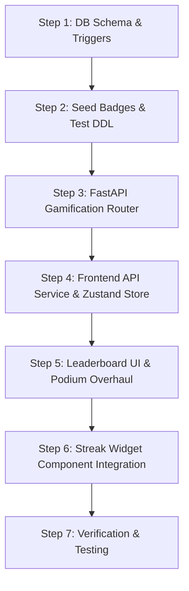

# BloodPing — Leaderboard & Streak Gamification Technical Specification & Execution Blueprint

**Branch:** `feature/leaderboard-streaks`  
**Target Platform:** Supabase (PostgreSQL + PL/pgSQL), FastAPI (Python), React (Vite SPA)  
**Author:** Antigravity AI Pair Programmer  

---

## 1. Executive Summary & Goals

The **Leaderboard & Streak Gamification System** aims to incentivize regular blood donations, increase donor retention, and foster community recognition on BloodPing.

### Key Technical Challenges & Solutions
1. **Medical Rest Period Constraint:** Unlike daily/weekly habits in standard gamification (e.g. Duolingo), safe blood donation mandates a **4-month rest period** between donations.
   * **Solution:** Streak logic calculates donation cadence based on **Eligible Windows** (donating within 4 to 6 months of a previous donation).
2. **Database-First Integrity:** Gamification logic, calculations, and rankings are calculated via **PL/pgSQL triggers** and **Materialized Views** in PostgreSQL rather than frontend code.

---

## 2. Gamification Architecture & Business Logic

### A. Streak Calculation Rules
* **Rest Period Window:** Standard donation eligibility opens **120 days (4 months)** after `last_donation_at`.
* **Streak Maintenance Window:** A donor has a **60-day Grace Window** after becoming eligible (between **Day 120** and **Day 180** since last donation) to complete their next donation.
* **Streak Increment:**
  * **First Donation:** `current_streak = 1`
  * **Within Grace Window (120 - 180 days since last donation):** `current_streak = current_streak + 1`
  * **Late (> 180 days since last donation):** `current_streak = 1` (Streak resets)
* **Longest Streak:** Updated automatically whenever `current_streak > longest_streak`.

### B. Point System (Gamification Score)
* **Base Points:** +100 PTS per confirmed donation.
* **Urgent Request Bonus:** +50 PTS for responding to an `is_urgent = true` donation request.
* **Streak Multiplier Bonus:** +`current_streak * 25` PTS.
* **Rare Blood Group Bonus:** +30 PTS for O-, AB-, A-, B-.

### C. Badge Tier Matrix

| Badge Code | Name | Criteria | Icon / Symbol |
| :--- | :--- | :--- | :--- |
| `FIRST_BLOOD` | First Lifesaver | Completed 1 confirmed donation | 🩸 Drop |
| `BRONZE_HERO` | Bronze Hero | 3 Total Donations | 🥉 Bronze Shield |
| `SILVER_HERO` | Silver Hero | 5 Total Donations | 🥈 Silver Shield |
| `GOLD_HERO` | Gold Hero | 10 Total Donations | 🥇 Gold Shield |
| `STREAK_MASTER` | Streak Master | Maintained a 3-consecutive streak | 🔥 Flame |
| `URGENT_SAVIOR` | Emergency Responder | Responded to 3 urgent requests | ⚡ Lightning |

---

## 3. Database Schema & PL/pgSQL Specifications

### 3.1 DDL Extensions & Schema Changes

Add point & badge tracking columns to `donors` and create badge tables:

```sql
-- 1. Extend donors table with points and tier
ALTER TABLE public.donors 
ADD COLUMN IF NOT EXISTS points INTEGER NOT NULL DEFAULT 0 CHECK (points >= 0),
ADD COLUMN IF NOT EXISTS badge_count INTEGER NOT NULL DEFAULT 0 CHECK (badge_count >= 0);

-- 2. Master Badges Catalog
CREATE TABLE IF NOT EXISTS public.badges (
    id              UUID PRIMARY KEY DEFAULT uuid_generate_v4(),
    code            TEXT UNIQUE NOT NULL,
    title           TEXT NOT NULL,
    description     TEXT NOT NULL,
    icon_name       TEXT NOT NULL, -- Lucide icon identifier
    category        TEXT NOT NULL CHECK (category IN ('milestone', 'streak', 'special')),
    created_at      TIMESTAMPTZ NOT NULL DEFAULT NOW()
);

-- 3. Donor Badges Junction Table
CREATE TABLE IF NOT EXISTS public.donor_badges (
    id              UUID PRIMARY KEY DEFAULT uuid_generate_v4(),
    donor_id        UUID NOT NULL REFERENCES public.donors(id) ON DELETE CASCADE,
    badge_id        UUID NOT NULL REFERENCES public.badges(id) ON DELETE CASCADE,
    awarded_at      TIMESTAMPTZ NOT NULL DEFAULT NOW(),
    UNIQUE (donor_id, badge_id)
);
```

### 3.2 PL/pgSQL Function: Streak & Points Calculator Trigger

```sql
CREATE OR REPLACE FUNCTION public.process_donation_gamification()
RETURNS TRIGGER AS $$
DECLARE
    v_last_donation TIMESTAMPTZ;
    v_current_streak INT;
    v_longest_streak INT;
    v_days_since_last INT;
    v_is_urgent BOOLEAN;
    v_points_earned INT := 100; -- Base points
BEGIN
    -- Fetch donor's last donation date and current streak info
    SELECT last_donation_at, current_streak, longest_streak
    INTO v_last_donation, v_current_streak, v_longest_streak
    FROM public.donors
    WHERE id = NEW.donor_id;

    -- Check if request was urgent
    SELECT is_urgent INTO v_is_urgent
    FROM public.donation_requests
    WHERE id = NEW.request_id;

    IF v_is_urgent THEN
        v_points_earned := v_points_earned + 50;
    END IF;

    -- Determine streak count
    IF v_last_donation IS NULL THEN
        -- First donation ever
        v_current_streak := 1;
    ELSE
        v_days_since_last := EXTRACT(DAY FROM (NEW.donated_at - v_last_donation));
        
        -- Eligible after 120 days, grace window up to 180 days
        IF v_days_since_last BETWEEN 115 AND 185 THEN
            v_current_streak := v_current_streak + 1;
        ELSIF v_days_since_last < 115 THEN
            -- Unusually rapid (or test data), maintain streak
            v_current_streak := v_current_streak;
        ELSE
            -- Passed 185 days without donating, reset streak
            v_current_streak := 1;
        END IF;
    END IF;

    -- Streak bonus points
    v_points_earned := v_points_earned + (v_current_streak * 25);

    -- Update longest streak
    IF v_current_streak > v_longest_streak THEN
        v_longest_streak := v_current_streak;
    END IF;

    -- Update Donor Stats
    UPDATE public.donors
    SET 
        total_donations = total_donations + 1,
        current_streak = v_current_streak,
        longest_streak = v_longest_streak,
        points = points + v_points_earned,
        last_donation_at = NEW.donated_at,
        rest_period_until = NEW.donated_at + INTERVAL '4 months',
        updated_at = NOW()
    WHERE id = NEW.donor_id;

    -- Refresh Leaderboard View asynchronously or explicitly
    PERFORM public.refresh_leaderboard();

    RETURN NEW;
END;
$$ LANGUAGE plpgsql SECURITY DEFINER;
```

### 3.3 Updated Leaderboard Materialized View

```sql
DROP MATERIALIZED VIEW IF EXISTS public.leaderboard CASCADE;

CREATE MATERIALIZED VIEW public.leaderboard AS
SELECT
    d.id                            AS donor_id,
    p.full_name,
    p.username,
    p.avatar_url,
    p.location_name,
    d.blood_group,
    d.total_donations,
    d.current_streak,
    d.longest_streak,
    d.points,
    d.last_donation_at,
    d.rest_period_until,
    RANK() OVER (ORDER BY d.points DESC, d.total_donations DESC, d.current_streak DESC) AS rank_overall,
    RANK() OVER (PARTITION BY d.blood_group ORDER BY d.points DESC) AS rank_by_blood_group
FROM public.donors d
JOIN public.profiles p ON p.id = d.user_id
WHERE d.total_donations > 0
WITH DATA;

CREATE UNIQUE INDEX idx_leaderboard_donor_id ON public.leaderboard(donor_id);
```

---

## 4. Backend API Endpoints (FastAPI Router)

File to create/update: `backend/app/routers/gamification_router.py`

### API Specifications

| Method | Endpoint | Description | Response Model |
| :--- | :--- | :--- | :--- |
| `GET` | `/api/v1/gamification/leaderboard` | Fetch paginated leaderboard with filter by blood group & search | `LeaderboardResponse` |
| `GET` | `/api/v1/gamification/streak/my-status` | Get authenticated donor's streak countdown and streak health | `StreakStatusResponse` |
| `GET` | `/api/v1/gamification/badges/{donor_id}` | Get earned and locked badges for a donor | `DonorBadgesResponse` |

---

## 5. Frontend UI/UX Blueprint (React Component Structure)

### Key Frontend Views & Components
1. **Leaderboard Page (`frontend/src/pages/Leaderboard.tsx`):**
   * **Podium Display (Top 3):** Highlighting #1 (Gold), #2 (Silver), #3 (Bronze) with custom animations and rank halos.
   * **Filter Bar:** Switch between `All Donors`, `By Blood Group`, and `Streak Leaders`.
   * **Donor Leaderboard Card:** Displays rank, avatar, blood group, points badge, total donations, and active streak flame count.
2. **Streak Card Widget (`frontend/src/components/gamification/StreakCard.tsx`):**
   * **Animated Flame Counter:** Shows current streak count (e.g. `🔥 3 Cycle Streak`).
   * **Rest Period & Eligibility Progress Bar:** Visual indicator showing days completed in the 4-month rest period and days remaining until next donation eligibility.
   * **Streak Status Badge:** `Active`, `Resting (Safe)`, `Eligible (Action Needed)`, or `At Risk`.
3. **Badge Showcase Modal/Section:**
   * Grid displaying unlocked badges in vibrant colors and locked badges with lock overlays.

---

## 6. Implementation Step-by-Step Execution Plan



### Phase 1: Database Setup
- [ ] Create migration script `database/migrations/005_gamification_streaks_leaderboard.sql`.
- [ ] Execute migration against Supabase/local PostgreSQL.
- [ ] Verify `leaderboard` materialized view and `process_donation_gamification` trigger function.

### Phase 2: Backend Development
- [ ] Create `backend/app/schemas/gamification.py` with Pydantic models.
- [ ] Create `backend/app/routers/gamification_router.py`.
- [ ] Register router in `backend/app/main.py`.

### Phase 3: Frontend Development
- [ ] Add `gamificationService.ts` for API requests.
- [ ] Create `StreakCard.tsx` widget.
- [ ] Redesign `Leaderboard.tsx` with top-3 podiums, streak counters, and blood group filters.
- [ ] Add badge display dialog/section on donor profile stats (`DonorProfileStats.tsx`).

### Phase 4: Quality Assurance & Verification
- [ ] Test streak calculations for first-time vs returning donors.
- [ ] Verify leaderboard ranking matches `points` order.
- [ ] Ensure dark/glassmorphic responsive styling meets BloodPing UI standards.
