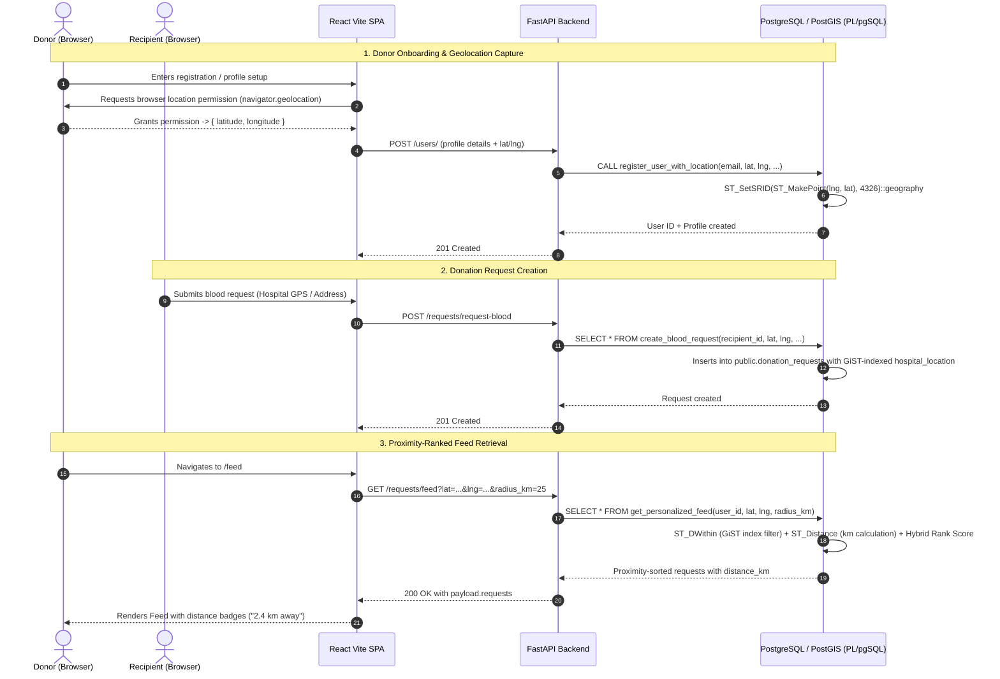

# Geolocation-Based Feed Algorithm: Architecture & Implementation Plan

## 1. Executive Summary & Core Concept

In **BloodPing**, rapid matching of blood recipients with nearby donors is life-critical. The geolocation-based feed algorithm ensures that when an urgent donation request is published, willing donors located closest to the hospital or donation center see the request at the very top of their feed, accompanied by an exact estimated distance (e.g., *"1.8 km away"*).

Following BloodPing's **database-first architecture**, all spatial geometry operations, distance metrics, coordinate validations, and ranking calculations reside inside PostgreSQL using **PostGIS** and **PL/pgSQL**. The FastAPI backend operates as a thin routing and security orchestration layer, and the React frontend captures coordinates using the browser's native **HTML5 Geolocation API**.

---

## 2. End-to-End System Architecture



---

## 3. Database Layer (PostgreSQL, PostGIS & PL/pgSQL)

### 3.1 Spatial Storage & Coordinate Reference System (CRS)
* **Coordinate Standard**: WGS 84 (`EPSG:4326`), the standard coordinate system for GPS and web mapping.
* **Storage Type**: `public.GEOGRAPHY(POINT, 4326)`.
  > [!NOTE]
  > We use PostgreSQL's `GEOGRAPHY` rather than `GEOMETRY`. While `GEOMETRY` calculates distances on a Cartesian flat plane, `GEOGRAPHY` calculates great-circle distances along the spherical/ellipsoidal surface of the Earth, natively outputting distances in meters without requiring map projection distortions.

* **Existing Tables Leveraging Geospatial Coordinates**:
  1. `public.profiles`: Column `location public.GEOGRAPHY(POINT, 4326)` stores user registration/home GPS.
  2. `public.donation_requests`: Column `hospital_location public.GEOGRAPHY(POINT, 4326)` stores the donation hospital coordinates.
  3. `public.donations`: Column `donor_location public.GEOGRAPHY(POINT, 4326)` stores audit snapshot at time of fulfillment.

### 3.2 Spatial Indexing Strategy
To prevent sequential table scans when querying large volumes of requests, we utilize **GiST (Generalized Search Tree)** indexes:
```sql
CREATE INDEX IF NOT EXISTS idx_profiles_location 
ON public.profiles USING GIST(location);

CREATE INDEX IF NOT EXISTS idx_donation_requests_hospital_location 
ON public.donation_requests USING GIST(hospital_location);
```
GiST indexes support spatial bounding box operators (`&&`), proximity bounding (`ST_DWithin`), and k-Nearest Neighbor (k-NN) ordering using the `<->` distance operator.

---

### 3.3 PL/pgSQL Functions & Procedures Design

#### A. Registration Stored Procedure with Geolocation
Encapsulates user profile creation and spatial conversion inside the database:

```sql
CREATE OR REPLACE PROCEDURE public.register_user_with_location(
    p_email TEXT,
    p_full_name TEXT,
    p_username TEXT,
    p_date_of_birth DATE,
    p_phone TEXT,
    p_blood_group public.blood_group,
    p_latitude DOUBLE PRECISION,
    p_longitude DOUBLE PRECISION,
    p_location_name TEXT,
    p_travel_radius_km NUMERIC,
    OUT p_user_id UUID
)
LANGUAGE plpgsql
SECURITY DEFINER
AS $$
DECLARE
    v_location public.GEOGRAPHY(POINT, 4326);
BEGIN
    -- 1. Validate age constraint (18+)
    IF p_date_of_birth > (CURRENT_DATE - INTERVAL '18 years') THEN
        RAISE EXCEPTION 'User must be at least 18 years old to register.';
    END IF;

    -- 2. Validate latitude & longitude boundaries
    IF p_latitude IS NOT NULL AND p_longitude IS NOT NULL THEN
        IF p_latitude < -90.0 OR p_latitude > 90.0 THEN
            RAISE EXCEPTION 'Invalid latitude value: %. Must be between -90 and 90.', p_latitude;
        END IF;
        IF p_longitude < -180.0 OR p_longitude > 180.0 THEN
            RAISE EXCEPTION 'Invalid longitude value: %. Must be between -180 and 180.', p_longitude;
        END IF;
        -- Transform coordinates into PostGIS geography point (Longitude first, then Latitude)
        v_location := ST_SetSRID(ST_MakePoint(p_longitude, p_latitude), 4326)::public.GEOGRAPHY;
    ELSE
        v_location := NULL;
    END IF;

    -- 3. Resolve or insert auth.users ID
    SELECT id INTO p_user_id FROM auth.users WHERE email = p_email;
    IF p_user_id IS NULL THEN
        p_user_id := gen_random_uuid();
        INSERT INTO auth.users (id, email) VALUES (p_user_id, p_email);
    END IF;

    -- 4. Upsert profile record
    INSERT INTO public.profiles (
        id, full_name, username, date_of_birth, phone, location, location_name, created_at, updated_at
    ) VALUES (
        p_user_id, p_full_name, p_username, p_date_of_birth, p_phone, v_location, p_location_name, NOW(), NOW()
    )
    ON CONFLICT (id) DO UPDATE SET
        full_name = EXCLUDED.full_name,
        username = EXCLUDED.username,
        date_of_birth = EXCLUDED.date_of_birth,
        phone = EXCLUDED.phone,
        location = COALESCE(EXCLUDED.location, profiles.location),
        location_name = COALESCE(EXCLUDED.location_name, profiles.location_name),
        updated_at = NOW();

    -- 5. Initialize donor record with specified blood group and travel radius
    INSERT INTO public.donors (
        user_id, blood_group, travel_radius_km, is_available, created_at, updated_at
    ) VALUES (
        p_user_id, p_blood_group, COALESCE(p_travel_radius_km, 15.0), TRUE, NOW(), NOW()
    )
    ON CONFLICT (user_id) DO UPDATE SET
        blood_group = EXCLUDED.blood_group,
        travel_radius_km = COALESCE(EXCLUDED.travel_radius_km, donors.travel_radius_km),
        updated_at = NOW();

    -- 6. Initialize recipient record
    INSERT INTO public.recipients (user_id, is_active)
    VALUES (p_user_id, TRUE)
    ON CONFLICT (user_id) DO NOTHING;

EXCEPTION
    WHEN OTHERS THEN
        RAISE EXCEPTION 'Registration failed in PL/pgSQL: %', SQLERRM;
END;
$$;
```

---

#### B. Distance Calculation: PostGIS vs. Pure PL/pgSQL Haversine Formula
For DBMS-II evaluation, having both native PostGIS spherical geodesic calculations and a pure PL/pgSQL Haversine implementation demonstrates comprehensive database proficiency:

```sql
-- Pure mathematical Haversine implementation in PL/pgSQL (Formula: d = 2R × asin(sqrt(...)))
CREATE OR REPLACE FUNCTION public.calculate_haversine_distance_km(
    p_lat1 DOUBLE PRECISION,
    p_lng1 DOUBLE PRECISION,
    p_lat2 DOUBLE PRECISION,
    p_lng2 DOUBLE PRECISION
)
RETURNS DOUBLE PRECISION
LANGUAGE plpgsql
IMMUTABLE
AS $$
DECLARE
    v_earth_radius CONSTANT DOUBLE PRECISION := 6371.0; -- Earth radius in KM
    v_dlat DOUBLE PRECISION;
    v_dlng DOUBLE PRECISION;
    v_a DOUBLE PRECISION;
    v_c DOUBLE PRECISION;
BEGIN
    -- Convert degrees to radians
    v_dlat := radians(p_lat2 - p_lat1);
    v_dlng := radians(p_lng2 - p_lng1);

    v_a := sin(v_dlat / 2.0) ^ 2 +
           cos(radians(p_lat1)) * cos(radians(p_lat2)) * (sin(v_dlng / 2.0) ^ 2);
           
    v_c := 2.0 * atan2(sqrt(v_a), sqrt(1.0 - v_a));

    RETURN ROUND((v_earth_radius * v_c)::numeric, 2);
END;
$$;
```

> [!TIP]
> **Performance Recommendation**: For spatial queries that scan table rows, use PostGIS `ST_Distance(geography, geography)` combined with `ST_DWithin` because PostGIS leverages C-level compiled libraries (GEOS / Proj) and GiST index bounding boxes, whereas pure PL/pgSQL mathematical functions execute in interpreted engine loops.

---

#### C. The Geolocation-Based Feed Algorithm (`get_personalized_feed`)
This function drives the intelligent feed ranking.

**Feed Algorithm Factors**:
1. **Dynamic Coordinate Resolution**: Checks if the caller passed live browser GPS coordinates. If `NULL`, it falls back to the user's saved `profiles.location`.
2. **Spatial Index Pruning**: Uses `ST_DWithin(dr.hospital_location, v_user_point, p_max_radius_km * 1000)` to eliminate distant requests using the GiST index.
3. **Exact Distance Calculation**: Calculates `ST_Distance(dr.hospital_location, v_user_point) / 1000.0` as `distance_km`.
4. **Multi-Factor Ranking Formula**:
   - **Urgency Multiplier**: Urgent requests (`is_urgent = TRUE`) receive an immediate score boost.
   - **Proximity Weight**: Requests closer to the user rank higher.
   - **Blood Group Compatibility**: When a donor is viewing, blood compatibility (e.g., $O^-$ donor matches all, compatible types ranked higher) can be prioritized.
   - **Recency Decay**: Open requests closer to deadline or recently posted are surfaced.

```sql
CREATE OR REPLACE FUNCTION public.get_personalized_feed(
    p_user_id UUID,
    p_user_lat DOUBLE PRECISION DEFAULT NULL,
    p_user_lng DOUBLE PRECISION DEFAULT NULL,
    p_max_radius_km NUMERIC DEFAULT 50.0,
    p_blood_group_filter public.blood_group DEFAULT NULL,
    p_limit INTEGER DEFAULT 20,
    p_offset INTEGER DEFAULT 0
)
RETURNS TABLE (
    request_id UUID,
    blood_group public.blood_group,
    units_required SMALLINT,
    units_fulfilled SMALLINT,
    hospital_name TEXT,
    hospital_lat DOUBLE PRECISION,
    hospital_lng DOUBLE PRECISION,
    hospital_address TEXT,
    search_radius_km NUMERIC(5,2),
    is_urgent BOOLEAN,
    notes TEXT,
    required_by TIMESTAMPTZ,
    status public.donation_request_status,
    created_at TIMESTAMPTZ,
    recipient_name TEXT,
    recipient_phone TEXT,
    distance_km DOUBLE PRECISION,
    match_score DOUBLE PRECISION
)
LANGUAGE plpgsql
STABLE
SECURITY DEFINER
AS $$
DECLARE
    v_user_location public.GEOGRAPHY(POINT, 4326);
    v_donor_blood public.blood_group;
BEGIN
    -- 1. Determine user reference point (Live GPS takes precedence over profile GPS)
    IF p_user_lat IS NOT NULL AND p_user_lng IS NOT NULL THEN
        v_user_location := ST_SetSRID(ST_MakePoint(p_user_lng, p_user_lat), 4326)::public.GEOGRAPHY;
    ELSE
        SELECT location INTO v_user_location 
        FROM public.profiles 
        WHERE id = p_user_id;
    END IF;

    -- 2. Fetch viewing user's donor blood group for smart matching
    SELECT blood_group INTO v_donor_blood
    FROM public.donors
    WHERE user_id = p_user_id;

    RETURN QUERY
    SELECT 
        dr.id AS request_id,
        dr.blood_group,
        dr.units_required,
        dr.units_fulfilled,
        dr.hospital_name,
        ST_Y(dr.hospital_location::geometry) AS hospital_lat,
        ST_X(dr.hospital_location::geometry) AS hospital_lng,
        dr.hospital_address,
        dr.search_radius_km,
        dr.is_urgent,
        dr.notes,
        dr.required_by,
        dr.status,
        dr.created_at,
        p.full_name AS recipient_name,
        p.phone AS recipient_phone,
        -- Calculated Distance in Kilometers (NULL if no user location available)
        CASE 
            WHEN v_user_location IS NOT NULL THEN 
                ROUND((ST_Distance(dr.hospital_location, v_user_location) / 1000.0)::numeric, 2)::DOUBLE PRECISION
            ELSE 0.0
        END AS distance_km,
        -- Composite Ranking Score: Higher is better
        (
            -- Proximity score component (Max 100 pts, decays with distance)
            CASE 
                WHEN v_user_location IS NOT NULL THEN 
                    GREATEST(0.0, 100.0 - (ST_Distance(dr.hospital_location, v_user_location) / 1000.0) * 1.5)
                ELSE 50.0 
            END
            -- Urgency bonus (+40 pts)
            + (CASE WHEN dr.is_urgent THEN 40.0 ELSE 0.0 END)
            -- Exact blood match bonus (+25 pts)
            + (CASE WHEN v_donor_blood IS NOT NULL AND dr.blood_group = v_donor_blood THEN 25.0 ELSE 0.0 END)
            -- Time freshness bonus (+15 pts for requests within 24h)
            + (CASE WHEN dr.created_at >= NOW() - INTERVAL '24 hours' THEN 15.0 ELSE 0.0 END)
        ) AS match_score
    FROM public.donation_requests dr
    INNER JOIN public.recipients r ON dr.recipient_id = r.id
    INNER JOIN public.profiles p ON r.user_id = p.id
    WHERE dr.status = 'open'::public.donation_request_status
      AND dr.required_by > NOW()
      AND (p_blood_group_filter IS NULL OR dr.blood_group = p_blood_group_filter)
      -- Spatial filter: Only filter if user location is available and radius specified
      AND (
          v_user_location IS NULL 
          OR p_max_radius_km IS NULL 
          OR ST_DWithin(dr.hospital_location, v_user_location, p_max_radius_km * 1000.0)
      )
    ORDER BY 
        -- Proximity & urgency order: Urgent items within user range appear first, followed by score
        dr.is_urgent DESC,
        match_score DESC,
        dr.created_at DESC
    LIMIT p_limit
    OFFSET p_offset;

EXCEPTION
    WHEN OTHERS THEN
        RAISE EXCEPTION 'get_personalized_feed failed: %', SQLERRM;
END;
$$;
```

---

## 4. Backend (FastAPI) Layer

### 4.1 Request & Response Schemas (`schemas/request_schema.py`)
```python
from pydantic import BaseModel, Field
from typing import Optional, List
from datetime import datetime

class FeedQueryParams(BaseModel):
    lat: Optional[float] = Field(None, ge=-90.0, le=90.0, description="Viewer latitude")
    lng: Optional[float] = Field(None, ge=-180.0, le=180.0, description="Viewer longitude")
    radius_km: Optional[float] = Field(50.0, ge=1.0, le=500.0, description="Search radius in KM")
    blood_group: Optional[str] = Field(None, description="Optional blood group filter")
    limit: Optional[int] = Field(20, ge=1, le=100)
    offset: Optional[int] = Field(0, ge=0)

class FeedItem(BaseModel):
    id: str
    hospital_name: str
    hospital_lat: float
    hospital_lng: float
    hospital_address: str
    blood_group: str
    units_required: int
    units_fulfilled: int
    is_urgent: bool
    notes: Optional[str]
    required_by: datetime
    created_at: datetime
    recipient_name: str
    recipient_phone: Optional[str]
    distance_km: float
    match_score: float
```

### 4.2 Router Endpoint (`routers/request_router.py`)
Add a dedicated `/requests/feed` endpoint:
```python
@router.get("/feed", response_model=StandardResponse)
def get_personalized_feed(
    lat: Optional[float] = None,
    lng: Optional[float] = None,
    radius_km: Optional[float] = 50.0,
    blood_group: Optional[str] = None,
    limit: int = 20,
    offset: int = 0,
    user_id: str = Depends(requireAuth)
):
    """
    Retrieves proximity-ranked blood donation feed for the authenticated user,
    calculated via PostGIS and PL/pgSQL.
    """
    feed = RequestService.get_feed(
        user_id=user_id,
        lat=lat,
        lng=lng,
        radius_km=radius_km,
        blood_group=blood_group,
        limit=limit,
        offset=offset
    )
    return {
        "success": True,
        "code": 200,
        "message": "Personalized feed retrieved successfully.",
        "payload": {"requests": feed}
    }
```

### 4.3 Service Implementation (`services/request_service.py`)
```python
@staticmethod
def get_feed(user_id: str, lat: Optional[float], lng: Optional[float], radius_km: float, blood_group: Optional[str], limit: int, offset: int) -> List[Dict[str, Any]]:
    with get_db_connection() as db:
        with db.cursor() as cursor:
            try:
                cursor.execute(
                    """
                    SELECT * FROM public.get_personalized_feed(
                        %s::UUID,
                        %s::DOUBLE PRECISION,
                        %s::DOUBLE PRECISION,
                        %s::NUMERIC,
                        %s::public.blood_group,
                        %s::INTEGER,
                        %s::INTEGER
                    );
                    """,
                    (user_id, lat, lng, radius_km, blood_group, limit, offset)
                )
                rows = cursor.fetchall()
                return [_format_feed_row(r) for r in rows]
            except Exception as e:
                logger.error(f"Error executing get_personalized_feed for user {user_id}: {e}")
                raise HTTPException(
                    status_code=status.HTTP_500_INTERNAL_SERVER_ERROR,
                    detail="Failed to retrieve geolocation feed."
                )
```

---

## 5. Frontend Layer (React & Vite SPA)

### 5.1 Browser Geolocation Hook (`hooks/useGeolocation.ts`)
Creates a reusable, reactive hook encapsulating the HTML5 Geolocation API:

```typescript
import { useState, useEffect, useCallback } from 'react';

export interface GeolocationState {
  latitude: number | null;
  longitude: number | null;
  accuracy: number | null;
  error: string | null;
  loading: boolean;
  permissionState: 'prompt' | 'granted' | 'denied' | 'unsupported';
}

export function useGeolocation(autoFetch = false) {
  const [state, setState] = useState<GeolocationState>({
    latitude: null,
    longitude: null,
    accuracy: null,
    error: null,
    loading: false,
    permissionState: 'prompt',
  });

  const requestLocation = useCallback(() => {
    if (!navigator.geolocation) {
      setState(prev => ({
        ...prev,
        error: 'Geolocation is not supported by your browser.',
        permissionState: 'unsupported'
      }));
      return;
    }

    setState(prev => ({ ...prev, loading: true, error: null }));

    navigator.geolocation.getCurrentPosition(
      (position) => {
        setState({
          latitude: position.coords.latitude,
          longitude: position.coords.longitude,
          accuracy: position.coords.accuracy,
          error: null,
          loading: false,
          permissionState: 'granted'
        });
      },
      (err) => {
        let errorMessage = 'Failed to get location.';
        let permState: 'prompt' | 'granted' | 'denied' = 'prompt';
        if (err.code === err.PERMISSION_DENIED) {
          errorMessage = 'Location permission was denied. Please enable location to find nearby requests.';
          permState = 'denied';
        } else if (err.code === err.POSITION_UNAVAILABLE) {
          errorMessage = 'Location information is unavailable.';
        } else if (err.code === err.TIMEOUT) {
          errorMessage = 'Location request timed out.';
        }
        setState({
          latitude: null,
          longitude: null,
          accuracy: null,
          error: errorMessage,
          loading: false,
          permissionState: permState
        });
      },
      {
        enableHighAccuracy: true,
        timeout: 10000,
        maximumAge: 60000 // Cache for 1 min
      }
    );
  }, []);

  useEffect(() => {
    if (autoFetch) {
      requestLocation();
    }
  }, [autoFetch, requestLocation]);

  return { ...state, requestLocation };
}
```

---

### 5.2 User Registration / Profile Setup Integration (`SetupProfilePage.tsx`)
1. **Interactive Permission Prompt**: Display a prominent button *"Detect My Current Location"*.
2. **Reverse Geocoding / Location Name**: Automatically resolve the coordinates to a human-readable city/area name (using OpenStreetMap Nominatim or standard city fallback) while keeping the exact `lat` and `lng`.
3. **Manual Fallback**: If GPS permission is denied by the user, provide manual city selection or map coordinate picker so user registration is never blocked.
4. **Backend Payload**: Submits `latitude` and `longitude` directly to `POST /users/`.

---

### 5.3 Donation Request Creation (`CreateRequestModal.tsx`)
1. Replace the current hardcoded `hospital_lat: 0.0, hospital_lng: 0.0`.
2. Add a *"Use Hospital's Current GPS"* button using the `useGeolocation` hook.
3. Allow entering coordinates or selecting from known hospital coordinates.

---

### 5.4 Proximity Feed Page (`FeedPage.tsx`)
1. **Distance Display**: Render an informative badge on every `RequestCard`:
   - *"📍 1.2 km away"* (Green badge for `< 5 km`)
   - *"📍 8.5 km away"* (Yellow badge for `5 - 15 km`)
   - *"📍 22.0 km away"* (Neutral badge for `> 15 km`)
2. **Proximity Radius Filter Slider**: Allow the user to adjust the search radius between `1 km` and `50 km`.
3. **Sorting**: Default to *"Nearest First"* (powered directly by the PL/pgSQL algorithm), with toggles for *"Most Urgent"* and *"Newest"*.

---

## 6. Implementation Roadmap

| Phase | Component | Key Deliverables | Status |
|---|---|---|---|
| **Phase 1** | **PL/pgSQL & PostGIS** | • `register_user_with_location.sql`<br>• `get_personalized_feed.sql`<br>• `calculate_haversine_distance_km.sql`<br>• Spatial GiST indexing verification | Ready to implement |
| **Phase 2** | **FastAPI Backend** | • `FeedQueryParams` & `FeedItem` Pydantic schemas<br>• `GET /requests/feed` router endpoint<br>• `RequestService.get_feed` database caller<br>• Update `user_service.py` to call `register_user_with_location` | Ready to implement |
| **Phase 3** | **Frontend UI/UX** | • `useGeolocation` custom React hook<br>• GPS detection in `SetupProfilePage.tsx`<br>• Hospital GPS capture in `CreateRequestModal.tsx`<br>• Distance badges & proximity ordering in `FeedPage.tsx` | Ready to implement |
| **Phase 4** | **Testing & Verification** | • Distance calculation accuracy tests<br>• PostgreSQL `EXPLAIN ANALYZE` index query benchmarking<br>• Permission denied & fallback scenarios | Ready to implement |

---

## 7. Key Architectural Decisions & Recommendations

> [!IMPORTANT]
> **1. Handling Permission Denial Gracefully**:
> Web browsers allow users to reject location access. When a user rejects GPS permissions:
> - Do not block registration or feed viewing.
> - Fallback to their IP address stored in `user_sessions.ip_address` or a default regional coordinate (e.g. Dhaka center: `23.8103, 90.4125`).
> - The PL/pgSQL function handles `p_user_lat IS NULL` safely by falling back to standard recency/urgency ranking without breaking.

> [!TIP]
> **2. DBMS-II Evaluation Highlights**:
> For curriculum assessment, this feature demonstrates:
> - **Spatial Indices**: GiST tree traversal vs. Sequential Scan.
> - **Stored Code**: PL/pgSQL procedural abstraction over business logic.
> - **Mathematical Algorithms**: PostGIS C-extensions vs. pure PL/pgSQL Haversine trigonometry.
> - **Declarative Constraints**: `CHECK` constraints on coordinate bounds ($-90 \le lat \le 90, -180 \le lng \le 180$).
