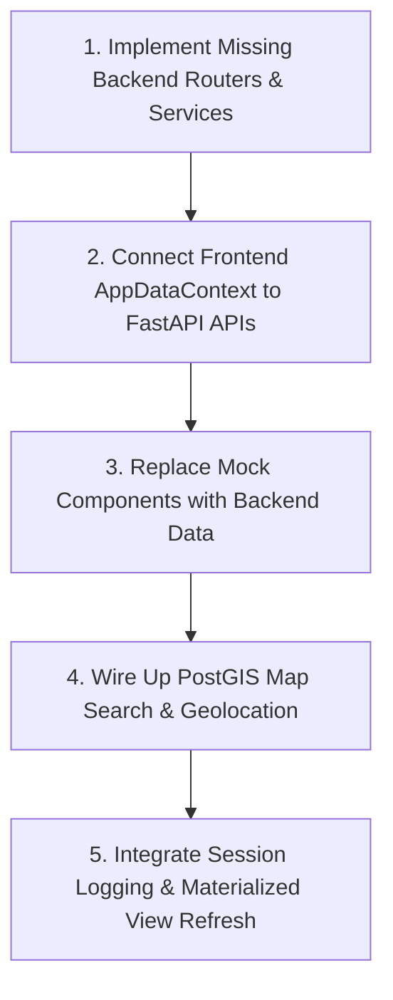

# Codebase Audit: BloodPing Project

This report provides a comprehensive review of the current codebase of **BloodPing**, detailing its architecture, completed components, logical flaws, missing features, and an action plan to complete the application.

---

## 1. Architectural Architecture & Alignment

The project is designed with a **Database-First / Fat-Database Architecture**. In this paradigm:
*   **PostgreSQL (Supabase)** is the engine for all business logic, location/distance metrics (via PostGIS), streak/gamification tracking, and validation rules.
*   **FastAPI Backend** acts as a slim, secure proxy routing layer that validates JWT auth headers and forwards calls directly to PL/pgSQL procedures.
*   **React Frontend** is a modern visual client that should communicate with the FastAPI backend.

---

## 2. Status of Codebase Modules

### A. Database (PL/pgSQL & Schema) — ~90% Complete
The database schema has a high degree of coverage. 
*   **Tables**: [profiles](file:///media/nafis/Software/BloodPing/database/ddl/ddl.sql#L63-L76) (extends Supabase auth), [donors](file:///media/nafis/Software/BloodPing/database/ddl/ddl.sql#L90-L105), [recipients](file:///media/nafis/Software/BloodPing/database/ddl/ddl.sql#L107-L114), [admins](file:///media/nafis/Software/BloodPing/database/ddl/ddl.sql#L116-L122), [donor_applications](file:///media/nafis/Software/BloodPing/database/ddl/ddl.sql#L124-L139), [donation_requests](file:///media/nafis/Software/BloodPing/database/ddl/ddl.sql#L162-L181), [donation_matches](file:///media/nafis/Software/BloodPing/database/ddl/ddl.sql#L183-L195), [donations](file:///media/nafis/Software/BloodPing/database/ddl/ddl.sql#L210-L220), [user_sessions](file:///media/nafis/Software/BloodPing/database/ddl/ddl.sql#L78-L88).
*   **Views**: A materialized view [leaderboard](file:///media/nafis/Software/BloodPing/database/ddl/ddl.sql#L226-L242) for gamification analytics.
*   **Functions**: 15+ standalone files in [`database/plpgsql/functions/`](file:///media/nafis/Software/BloodPing/database/plpgsql/functions) resolving user stats, search operations, eligibility checks, session logging, and distance calculations.

### B. FastAPI Backend — ~40% Complete
While the authentication flow (`JWTAuthMiddleware`) and basic profile endpoints are active, the endpoints that glue the business features together are missing.
*   **Active Routers**:
    *   [`user_router.py`](file:///media/nafis/Software/BloodPing/backend/app/routers/user_router.py): Handles profile updates and details.
    *   [`donor_router.py`](file:///media/nafis/Software/BloodPing/backend/app/routers/donor_router.py): Handles donor applications and status checks.
    *   [`recipient_router.py`](file:///media/nafis/Software/BloodPing/backend/app/routers/recipient_router.py): Checks recipient profile existence.
    *   [`admin_router.py`](file:///media/nafis/Software/BloodPing/backend/app/routers/admin_router.py): Reviews donor candidate applications.

### C. React Frontend — ~95% Complete UI / ~10% Integrated
The user interface is exceptionally polished with custom Tailwind CSS styles, Framer Motion animations, and a structured layout conforming to the [VitalCore](file:///media/nafis/Software/BloodPing/frontend/src/pages/VitalCore.tsx) design system. However, **almost all dynamic pages are currently mocked on the client side**.

---

## 3. Core Flaws & Integration Disconnects

### 🛑 Disconnect 1: Frontend Uses Mock Client-Side State
The primary integration gap is in [`AppDataContext.tsx`](file:///media/nafis/Software/BloodPing/frontend/src/context/AppDataContext.tsx). Nearly all operations operate strictly inside React state (`useState`) using hardcoded dummy data (`initialRequests` and `initialDonors`), including:
*   Creating a donation request (does not hit the database).
*   Applying to a request (does not create a `donation_matches` row in PostgreSQL).
*   Accepting/completing/canceling matches (points are added/deducted strictly in React memory).
*   Mock profile stats (streak and donation counts are hardcoded strings, e.g. `"12"` total donations in [`DonorProfileStats.tsx`](file:///media/nafis/Software/BloodPing/frontend/src/pages/DonorProfileStats.tsx#L117)).

### 🛑 Disconnect 2: FastAPI Schema Validation Dependency Block
In [`main.py`](file:///media/nafis/Software/BloodPing/backend/app/main.py#L26-L38), the backend executes a database schema audit (`verify_schema()`) at startup. This compares definition SQL files against the active database state. If there are schema drift or partial migrations, the backend will fail to start.

---

## 4. Incomplete & Unimplemented Features

### 1. Geolocation & Map Search Integration
*   **Database**: Has `PostGIS` queries [search_donors_by_location.sql](file:///media/nafis/Software/BloodPing/database/plpgsql/functions/10_search_donors_by_location.sql) to filter users based on distance.
*   **Backend**: ❌ **No endpoints** to perform location searches.
*   **Frontend**: ❌ [`DonorMapSearch.tsx`](file:///media/nafis/Software/BloodPing/frontend/src/pages/DonorMapSearch.tsx) displays a static image of a map with hardcoded marker overlays.

### 2. Donation Requests Pipeline
*   **Database**: Has table `donation_requests` and routines under [`database/plpgsql/functions/requests/`](file:///media/nafis/Software/BloodPing/database/plpgsql/functions/requests).
*   **Backend**: ❌ **No router or service** exists for requests. 
*   **Frontend**: [`FeedPage.tsx`](file:///media/nafis/Software/BloodPing/frontend/src/pages/FeedPage.tsx) reads/writes solely to React state.

### 3. Matching & Donations Ledger
*   **Database**: Has tables `donation_matches` and `donations` plus routines under [`database/plpgsql/functions/matches/`](file:///media/nafis/Software/BloodPing/database/plpgsql/functions/matches) and [`database/plpgsql/functions/donations/`](file:///media/nafis/Software/BloodPing/database/plpgsql/functions/donations).
*   **Backend**: ❌ **No routers or endpoints** to match a donor to a request, accept matches, or log fulfilled donations.
*   **Frontend**: Handled inside local arrays in [`AppDataContext.tsx`](file:///media/nafis/Software/BloodPing/frontend/src/context/AppDataContext.tsx).

### 4. Leaderboard & Streaks Gamification
*   **Database**: Has materialized view `leaderboard` and function [get_donor_leaderboard.sql](file:///media/nafis/Software/BloodPing/database/plpgsql/functions/09_get_donor_leaderboard.sql).
*   **Backend**: ❌ **No leaderboard routes** to pull sorted rankings.
*   **Frontend**: [`Leaderboard.tsx`](file:///media/nafis/Software/BloodPing/frontend/src/pages/Leaderboard.tsx) sorts a mock array in local state memory.

### 5. Audit Sessions Log
*   **Database**: Has table `user_sessions` and procedures `log_user_session` and `get_user_sessions`.
*   **Backend**: ❌ **No middleware integration** to capture client IPv4/IPv6 and MAC addresses and record sessions on login.

---

## 5. Proposed Execution Path

1.  **Backend Extensions**:
    *   Create a `request_router.py` & `request_service.py` to call functions like `public.create_donation_request` and retrieve lists.
    *   Create a `match_router.py` & `match_service.py` to bind matching steps (`apply`, `accept`, `confirm`, `cancel`).
    *   Create a `leaderboard_router.py` to invoke `public.get_donor_leaderboard()`.
2.  **Frontend API Integration**:
    *   Refactor [`AppDataContext.tsx`](file:///media/nafis/Software/BloodPing/frontend/src/context/AppDataContext.tsx) to query backend HTTP routes using [`apiClient.ts`](file:///media/nafis/Software/BloodPing/frontend/src/services/apiClient.ts) instead of using local memory arrays.
3.  **Real Data Binding**:
    *   Feed [`DonorProfileStats.tsx`](file:///media/nafis/Software/BloodPing/frontend/src/pages/DonorProfileStats.tsx) with the actual stats returned from the database functions.
    *   Wire up real map markers in [`DonorMapSearch.tsx`](file:///media/nafis/Software/BloodPing/frontend/src/pages/DonorMapSearch.tsx).
